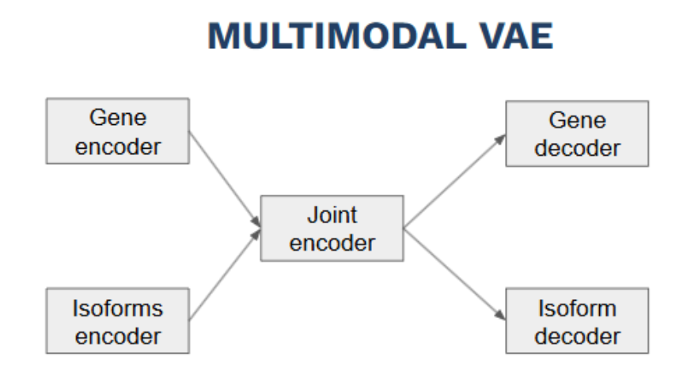
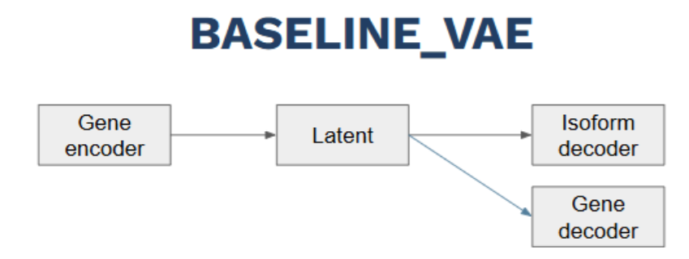
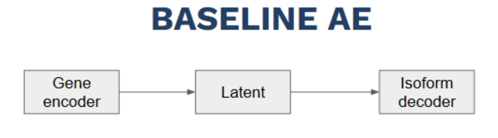
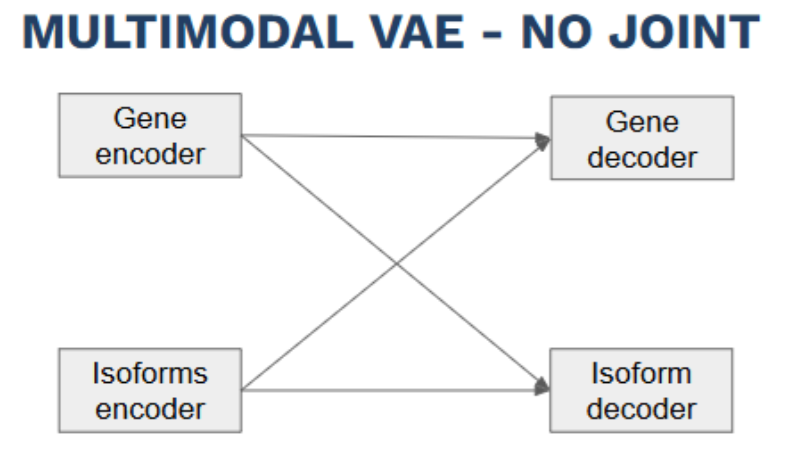

# Models Module

This module contains implementations of four models for joint analysis of gene and isoform expression data:

1. **Multimodal Variational Autoencoder (VAE)**
2. **Baseline VAE (Unimodal)**
3. **Baseline Autoencoder (Baseline_AE)**
4. **Multimodal VAE without Joint Latent Space (MultimodalVAE_NoJoint)**

---

## Table of Contents
- [Model Overview](#model-overview)
- [Multimodal VAE](#1-multimodal-vae)
- [Baseline VAE](#2-baseline-vae-unimodal)
- [Baseline Autoencoder](#3-baseline_ae)
- [Multimodal VAE No Joint](#4-multimodal-vae-no-joint)
- [Model Comparison](#model-comparison)
- [Usage Recommendations](#usage-recommendations)

---

## Models Overview

### 1. Multimodal VAE

**Architecture**:  
Dual encoders + Joint latent space + Dual decoders with cross-modal pathways  

**Input**: Both gene and isoform expression data  
**Output**: Joint reconstructions and cross-modal predictions  

**Key Features**:
- Learns joint representations of both modalities
- Models uncertainty via variational inference
- Supports MSE and Gaussian reconstruction losses
- Optional cross-modal prediction pathways
- Flexible configuration through hyperparameters

**Use Cases**:
- Joint gene and isoform analysis
- Cross-modal prediction (genes ↔ isoforms)
- Learning biologically meaningful latent representations
- Handling missing modalities during inference

**Hyperparameters**:
- `latent_dim`: Dimension of joint latent space (default: 64)
- `beta`: KL divergence weight (default: 0.01)
- `gamma_i`, `gamma_g`: Cross-modal loss weights (default: 0.6)
- `recon_loss_type`: 'mse' or 'gaussian'
- `hidden_dims`: Encoder/decoder hidden dimensions (default: [1024, 512])

---

### 2. Baseline VAE (Unimodal)

**Architecture**:  
Single encoder + Dual decoders  

**Input**: Gene expression data only  
**Output**: Gene reconstruction and isoform prediction  

**Key Features**:
- Uses gene data only
- Simpler than multimodal VAE
- Probabilistic latent space
- Direct gene→isoform mapping
- Supports MSE and Gaussian reconstruction losses

**Use Cases**:
- When isoform data is unavailable at inference time
- Resource-constrained settings
- Baseline for gene→isoform prediction

**Hyperparameters**:
- `latent_dim`: Latent space dimension (default: 64)
- `beta`: KL divergence weight (default: 0.01)
- `gamma`: Isoform prediction loss weight (default: 1.0)
- `hidden_dims`: Hidden layer dimensions (default: [1024, 512])

---

### 3. Baseline Autoencoder (Baseline_AE)

**Architecture**:  
Simple encoder-decoder autoencoder  

**Input**: Gene expression data  
**Output**: Isoform predictions  

**Key Features**:
- Deterministic architecture
- No latent space or variational inference
- Fast training and inference
- Easy to interpret and debug
- Serves as a performance floor

**Use Cases**:
- Quick performance baseline
- Prototyping and sanity checks
- Extremely resource-constrained scenarios

**Hyperparameters**:
- `hidden_dims`: Hidden layer dimensions (default: [512, 256])
- `learning_rate`: Optimization rate (default: 1e-3)
- `batch_size`: Training batch size (default: 256)

---

### 4. Multimodal VAE without Joint Latent Space

**Architecture**:  
Dual encoders + Separate latent spaces + Dual decoders + Optional cross-modal reconstruction  

**Input**: Gene and isoform expression data  
**Output**: Reconstructions from own latent space and optional cross-modal predictions  

**Key Features**:
- Separate latent space for each modality
- Optional cross-modal reconstructions
- Probabilistic latent modeling
- Handles missing modalities  
- Configurable Gaussian or MSE reconstruction loss  

**Use Cases**:
- Analyze modalities independently but allow cross-modal predictions
- Scenarios where joint latent space may be restrictive
- Probabilistic modeling without enforcing a shared latent space  

**Hyperparameters**:  
- `latent_dim`, `beta`, `gamma_i`, `gamma_g`, `recon_loss_type`, `hidden_dims`  
- `iso_from_gene`: Enable isoform prediction from genes  
- `gene_from_iso`: Enable gene prediction from isoforms  

---

## Model Comparison

| Feature                    | Multimodal VAE | Baseline VAE | Baseline_AE | MultimodalVAE_NoJoint |
|----------------------------|----------------|--------------|-------------|----------------------|
| **Input Modalities**       | Gene + Isoform | Gene only    | Gene only   | Gene + Isoform       |
| **Probabilistic**          | ✓              | ✓            | ✗           | ✓                    |
| **Latent Space**           | Joint multimodal | Standard   | None        | Separate per modality|
| **Cross-Modal Prediction** | ✓              | ✗            | ✗           | Optional             |
| **Parameter Count**        | High           | Medium       | Low         | Medium               |
| **Training Speed**         | Slow           | Medium       | Fast        | Medium               |
| **Best Use Case**          | Joint analysis | Gene→isoform prediction | Quick baseline | Independent multimodal analysis |

---

## Usage Recommendations

1. **Multimodal VAE**: Both gene and isoform data, cross-modal learning, uncertainty modeling, joint representations.  
2. **Baseline VAE**: Only gene data available, probabilistic predictions, limited resources.  
3. **Baseline Autoencoder (Baseline_AE)**: Quick baseline, simplicity, deterministic, minimal resources.  
4. **Multimodal VAE No Joint**: Separate latent spaces, optional cross-modal prediction, probabilistic modeling without enforcing joint latent space.
